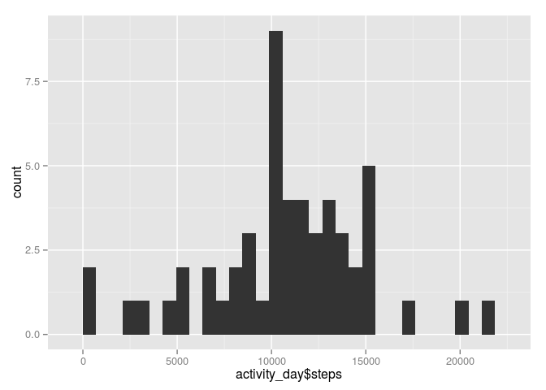
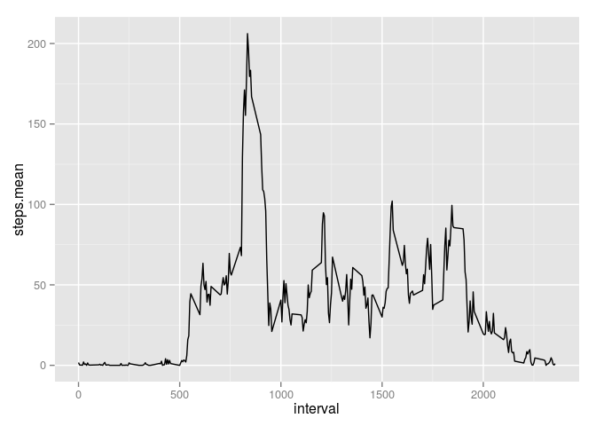
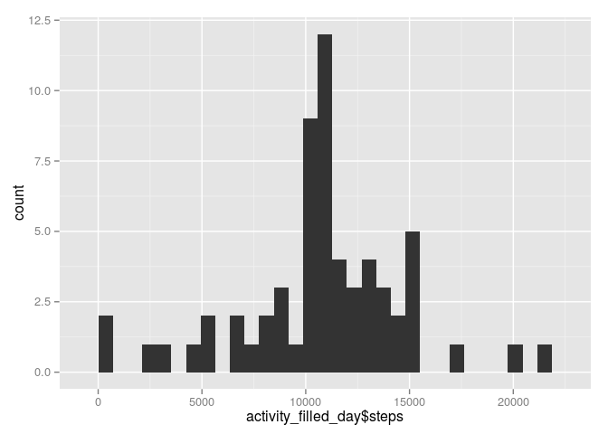

# Reproducible Research: Peer Assessment 1
Philip M. Woite  
Initial submission: 24 January 2016; Re-submitted on 31 January 2016  


## Loading and preprocessing the data
The text file *"activity.csv"* was read using *read.csv*, and subsequently "NA" observations were removed using *complete.cases* to form the data frames **activity_complete** and **activity_day**. The data frame **activity_day** is a summary of **activity_complete**, taking the sum of the steps taken on each of the unique days in the data frame **activity_complete**.


```r
require('ggplot2')
```

```
## Loading required package: ggplot2
```

```r
require('data.table')
```

```
## Loading required package: data.table
```

```r
require('dplyr')
```

```
## Loading required package: dplyr
```

```
## 
## Attaching package: 'dplyr'
```

```
## The following objects are masked from 'package:data.table':
## 
##     between, last
```

```
## The following objects are masked from 'package:stats':
## 
##     filter, lag
```

```
## The following objects are masked from 'package:base':
## 
##     intersect, setdiff, setequal, union
```

```r
require('tidyr')
```

```
## Loading required package: tidyr
```

```r
require('lubridate')
```

```
## Loading required package: lubridate
```

```
## Warning in library(package, lib.loc = lib.loc, character.only = TRUE,
## logical.return = TRUE, : there is no package called 'lubridate'
```

```r
require('doBy')
```

```
## Loading required package: doBy
```

```
## Loading required package: survival
```

```r
activity <- read.csv('activity.csv', header=TRUE)
activity_complete <- data.frame(activity[complete.cases(activity),])

activity_day <- data.frame(summaryBy(steps ~ date ,data = activity_complete, FUN = list(sum)))
```

## What is mean total number of steps taken per day?

Then plotting a histogram


```r
qplot(activity_day$steps, geom = "histogram")
```

```
## stat_bin: binwidth defaulted to range/30. Use 'binwidth = x' to adjust this.
```

<!-- -->

Evaluating the mean and median of the steps taken per day:


```r
mean_steps <- mean(activity_day$steps.sum, na.rm=TRUE)
print(mean_steps)
```

```
## [1] 10766.19
```

```r
median_steps <- median(activity_day$steps.sum, na.rm=TRUE)
print(median_steps)
```

```
## [1] 10765
```


## What is the average daily activity pattern?
A new data fram **activity_intervals** was created from the **activity_complete** data frame - again using *summaryBy* but now with the function being "mean" to take the average. This data is then plotted.


```r
activity_intervals <- data.frame(summaryBy(steps ~ interval, data = activity_complete , FUN = list(mean)))

ggplot(activity_intervals, aes(interval, steps.mean))+ geom_line()
```

<!-- -->

Finding the interval containing the maximum steps:


```r
max_interval <- which.max(activity_intervals[,2])
print(activity_intervals[max_interval,])
```

```
##     interval steps.mean
## 104      835   206.1698
```

## Imputing missing values
The number of missing values in *steps* in the **activity** data frame:


```r
missing_steps <- sum(is.na(activity$steps))
print(missing_steps)
```

```
## [1] 2304
```

To imput missing values, it was chosen to substitute *NA* values with the mean value in the interval of each of the *NA* values.


```r
activity_filled <- activity

activity_filled$steps <- ifelse(is.na(activity_filled$steps) == TRUE, activity_intervals$steps.mean, activity_filled$steps)

activity_filled_day <- data.frame(summaryBy(steps ~ date ,data = activity_filled, FUN = list(sum)))
```

Plotting and calculating the mean and median of the **activity_filled_day** data frame:


```r
qplot(activity_filled_day$steps, geom = "histogram")
```

```
## stat_bin: binwidth defaulted to range/30. Use 'binwidth = x' to adjust this.
```

<!-- -->

Evaluating the mean and median of the steps taken per day:


```r
mean_filled_steps <- mean(activity_filled_day$steps.sum, na.rm=TRUE)
print(mean_filled_steps)
```

```
## [1] 10766.19
```

```r
median_filled_steps <- median(activity_filled_day$steps.sum, na.rm=TRUE)
print(median_filled_steps)
```

```
## [1] 10766.19
```

The mean and median totals calculated now and in the earlier section differ. This difference may be ascribed to the substitution of average values skewing the median to the average. The second difference that was observed is that the mean and median values are now the same.

## Are there differences in activity patterns between weekdays and weekends?


```r
activity_weekdays <- data.frame(mutate(activity_filled_day, 
                            my_weekday = factor(weekdays(as.POSIXct(activity_filled_day$date)),
                            levels= c("Sunday", "Monday", "Tuesday", "Wednesday", "Thursday", "Friday", "Saturday"))))

with(activity_weekdays, my_weekday[activity_weekdays$my_weekday %in% c('Monday','Tuesday','Wednesday','Thursday','Friday')])
```

```
##  [1] Monday    Tuesday   Wednesday Thursday  Friday    Monday    Tuesday  
##  [8] Wednesday Thursday  Friday    Monday    Tuesday   Wednesday Thursday 
## [15] Friday    Monday    Tuesday   Wednesday Thursday  Friday    Monday   
## [22] Tuesday   Wednesday Thursday  Friday    Monday    Tuesday   Wednesday
## [29] Thursday  Friday    Monday    Tuesday   Wednesday Thursday  Friday   
## [36] Monday    Tuesday   Wednesday Thursday  Friday    Monday    Tuesday  
## [43] Wednesday Thursday  Friday   
## Levels: Sunday Monday Tuesday Wednesday Thursday Friday Saturday
```

```r
with(activity_weekdays, my_weekday[activity_weekdays$my_weekday %in% c('Saturday','Sunday')], plot(date,steps.sum))
```

```
##  [1] Saturday Sunday   Saturday Sunday   Saturday Sunday   Saturday
##  [8] Sunday   Saturday Sunday   Saturday Sunday   Saturday Sunday  
## [15] Saturday Sunday  
## Levels: Sunday Monday Tuesday Wednesday Thursday Friday Saturday
```
